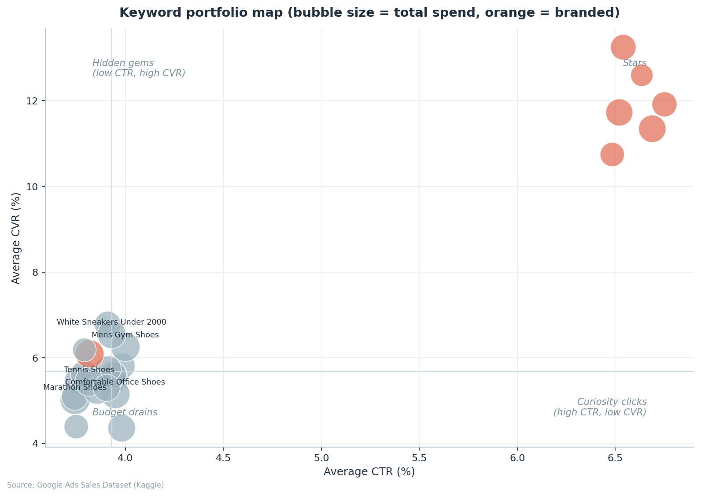
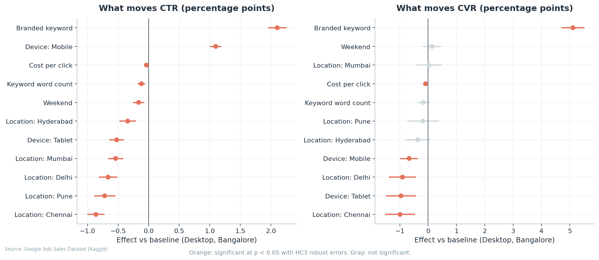

# Google Ads Performance Drivers


What actually moves click-through rate and conversion rate in a search
campaign? This project answers that question with a Kaggle Google Ads
dataset, working through cleaning, exploratory analysis, weighted regression,
and predictive modeling, and ends with recommendations a growth team could
act on the same week.



## Research questions

1. Which factors (device, location, keyword characteristics, timing) have
   the largest effect on CTR?
2. Which factors have the largest effect on conversion rate?
3. How well can CTR and CVR be predicted from the variables available before
   the click?
4. What should a growth or SEO team do differently based on the findings?

## Headline findings

These numbers come from the synthetic stand-in data shipped with the repo
(see the data section below). Re-run the pipeline on the real Kaggle file to
reproduce them on the original data.

- Branded intent is the strongest driver of both metrics. Branded keywords
  add roughly 2 percentage points of CTR and about 5 points of CVR versus
  comparable non-branded terms, holding device, location and price constant.
- Device pulls in opposite directions. Mobile lifts CTR by about 1 point over
  desktop but converts slightly worse per click. Cheap mobile clicks and
  reliable desktop conversions are two different jobs.
- Paying a higher CPC does not buy a better CTR. The coefficient is near zero
  once keyword type and device are controlled for.
- CTR is far more predictable than CVR (test R squared around 0.50 versus
  0.13 for the best models). That gap is informative: conversion is decided
  after the click, on pages this feature set cannot see, so the next useful
  data to collect is post-click, not more campaign metadata.

The regression view of the same story:



## Project structure

```
.
|-- run_pipeline.py            runs all four phases end to end
|-- src/
|   |-- data_prep.py           cleaning and feature engineering
|   |-- eda.py                 exploratory figures
|   |-- stats_analysis.py      weighted OLS models and hypothesis tests
|   |-- modeling.py            model comparison, importances, PDPs
|   |-- plotting.py            shared figure styling
|-- notebooks/                 executed, with all outputs embedded
|   |-- 01_data_preparation.ipynb
|   |-- 02_exploratory_analysis.ipynb
|   |-- 03_statistical_drivers.ipynb
|   |-- 04_predictive_modeling.ipynb
|-- scripts/
|   |-- make_sample_data.py    synthetic stand-in with the Kaggle schema
|   |-- build_notebooks.py     regenerates the notebooks from source
|   |-- init_repo.sh           builds the git history commit by commit
|-- app/
|   |-- dashboard.py           interactive Streamlit dashboard
|-- .github/workflows/
|   |-- pipeline.yml           CI: full pipeline runs on every push
|-- data/
|   |-- raw/                   place the Kaggle CSV here (gitignored)
|   |-- processed/             cleaned output (generated)
|-- reports/
    |-- figures/               all charts as PNG
    |-- tables/                regression summaries, scores, tests
    |-- executive_summary.md   one page version of the findings
```

## Data

The analysis targets the [Google Ads Sales Dataset](https://www.kaggle.com/datasets/nayakganesh007/google-ads-sales-dataset)
on Kaggle: ad-level records with keyword, device, location, date,
impressions, clicks, cost, conversions and sale amount. The file is
deliberately messy (currency symbols inside numbers, mixed date formats,
duplicates), which is half the fun. The cleaning step handles all of it.

The raw file is not committed. Two ways to get data in place:

```bash
# Option A: the real dataset
# download from Kaggle and save as data/raw/google_ads_sales.csv

# Option B: a synthetic stand-in with the same schema and the same mess
python scripts/make_sample_data.py
```

The generator documents exactly what signal it bakes in, so anyone can verify
the pipeline recovers known effects before trusting it on real data. That is
also a useful honesty check for the methods themselves.

## Quick start

```bash
git clone <this-repo>
cd google-ads-performance-drivers
pip install -r requirements.txt

python scripts/make_sample_data.py   # or drop the Kaggle CSV in data/raw/
python run_pipeline.py
```

The pipeline prints progress for each phase and writes 14 figures to
`reports/figures/` plus regression summaries, hypothesis tests and model
scores to `reports/tables/`.

To explore interactively:

```bash
streamlit run app/dashboard.py
```

Or read the notebooks in order, `01` through `04`. They are committed
executed, so every figure and regression table renders directly on GitHub
without running anything. Continuous integration runs the entire pipeline on
freshly generated sample data on every push, so a green badge means the
analysis is reproducible from a clean checkout.

## Methods in brief

**Cleaning.** Currency and percent symbols stripped, two date formats parsed,
duplicates dropped, rows failing physical sanity checks removed (clicks above
impressions, conversions above clicks).

**Feature engineering.** CTR, CVR, CPC, CPA, ROAS, revenue per click, keyword
length and word count, a branded flag based on brand tokens in the query, and
calendar features.

**Statistics.** Weighted least squares with statsmodels, one model per
target. Observations are weighted by their denominator (impressions for CTR,
clicks for CVR) because a rate measured on 40 impressions is much noisier
than one measured on 4,000. Standard errors are HC3 robust. Group
comparisons use Mann-Whitney U since the rates are right skewed.

**Modeling.** Ridge regression, random forest and histogram gradient
boosting compared on a 25 percent holdout with R squared, RMSE and MAE.
Driver rankings use permutation importance on the test set, which avoids the
bias impurity-based importance has toward high cardinality features. Partial
dependence plots show the shape of each relationship.

## Limitations

The dataset simulates one advertiser over one year at the ad level, so the
coefficients describe associations under a linear model, not causal effects.
Quality score, ad position, ad copy and landing page are unobserved, and the
low CVR R squared is largely their absence speaking. The point of the project
is the method: the pipeline runs unchanged on any export with this schema.

## Tools

pandas, numpy, matplotlib, seaborn, scipy, statsmodels, scikit-learn,
plotly and streamlit for the dashboard.

## License

MIT. See [LICENSE](LICENSE).
